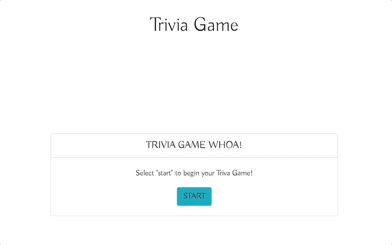
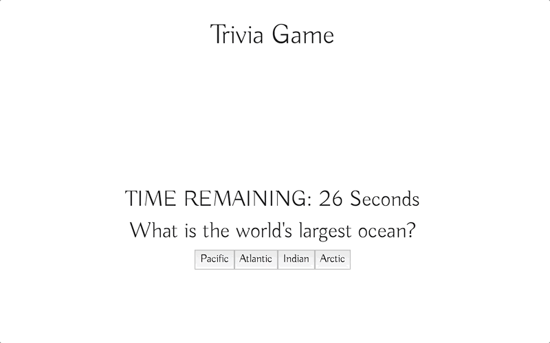
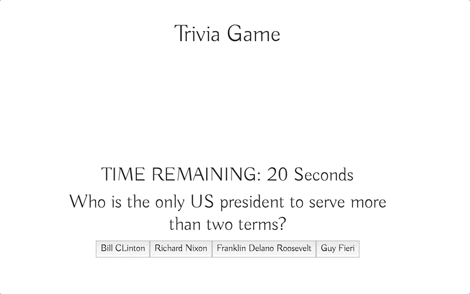

# Trivia Game

In the Trivia Game, user will go through five different questions, each one with a timer of 30 seconds, after a question is answered the screen will show wether or not it was correct, at the end of the game, user will see a score screen letting them know how many were correct, incorrect, or unanswered. If user wants to take a stab at it, they can easily click the "reset" button that will take them to the beginnning.


## Getting Started

User will begin on a question with a timer of 30 seconds, after being answered a screen will display letting them know the results, this will continue for all five questions. When the user is done they will see how they did, and have the option to retry.





### Want a Sneak Peak of the code? Well here you have it! 

Here we have the loadQuestionFunction which will loop through and pick out the intended question and answers, then display them along with the timer, who is firstly getting set up to go down by one.

```
  loadQuestion: function () {
    timer = setInterval(game.countdown, 1000 );

    $("#subwrapper").html("<h2>TIME REMAINING: <span id='counter'>30</span> Seconds </h2>");
    $("#subwrapper").append("<h2>" + questions[game.currentQuestion].question + "</h2>");
    for (var i = 0; i < questions[game.currentQuestion].answers.length; i++) {
      $("#subwrapper").append("<button class='answer-button'  id='button-"+ i + "' data-name= '"+ questions[game.currentQuestion].answers[i] + "'>"+ questions[game.currentQuestion].answers[i] + "</button>")
    }
  },

```


## Deployment

Check out the game here: [Trivia Game](https://delgador28.github.io/TriviaGame/) - Happy Answering!


## Made With

* HTML
* CSS 
* Bootstrap
* Javascript
* jQuery


Thanks for checking out my work! Want to see all of it? Click [Here](https://github.com/Delgador28?tab=repositories)!